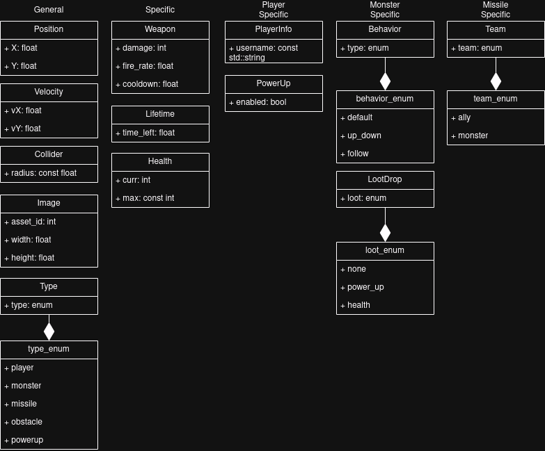
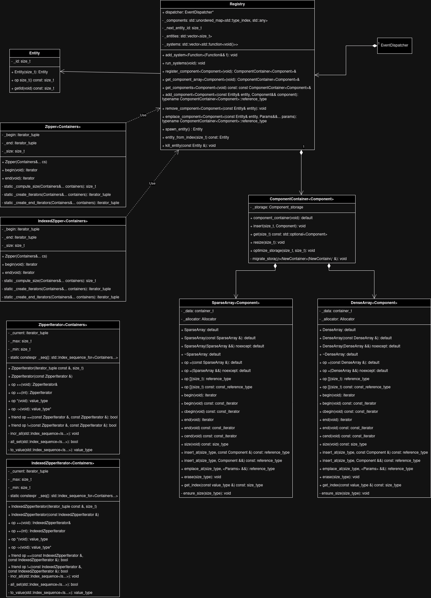
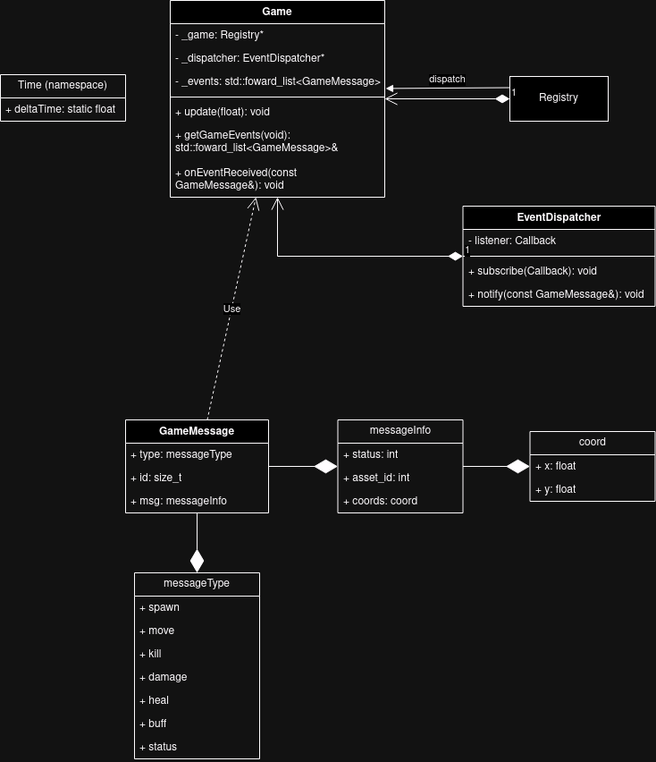

# R-Type Server-side Architecture

This document provides an overview of the architecture diagrams of the server-sided ECS.

---

## Component Hierarchy

The `Component Hierarchy` diagram illustrates the various components used in the game, including general, specific, player-specific, monster-specific, and missile-specific components. Each component defines attributes and behaviors for different entities in the game.

### Key Components:

- **General Components**: Common attributes like `Position`, `Velocity`, and `Collider`.
- **Specific Components**: Entity-specific properties such as `Weapon`, `Health`, and `PowerUp`.
- **Enums**: Enumerations for types, behaviors, teams, and loot drops.

---

## ECS Architecture

The `ECS Architecture` diagram outlines the Entity-Component-System (ECS) structure used for managing game entities and logic. It includes the following:

- **Registry**: Handles entities and their components, also contains the logic that processes components to implement gameplay features.
- **Entity**: Unique identifiers containing components.
- **Components**: Data units associated with entities.
- **Component Container**: Data structure to hold a `Component` type for all entities.
- **Zipper & IndexedZipper**: Data iterators to help iterate over several `Component Containers`

---

## Game Manager

The `Game Manager` diagram contains:

- **Game**: Runs the game systems according to the deltaTime and receives events from the systems.
- **EventDispatcher**: Dispatches the events to the `Game`.
- **GameMessage**: Data structure that holds the event's information.

